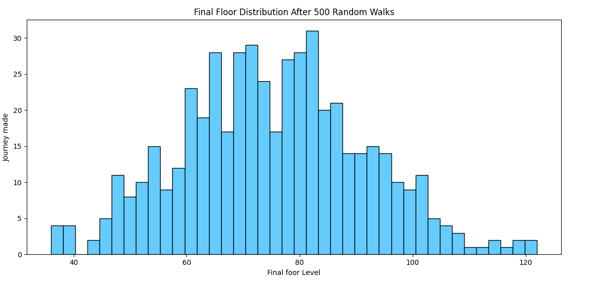

# 🎲 The Tower of Fate

Welcome to the Tower of Fate, a mystical structure with 100 floors. You are a brave Data Adventurer, and each journey is a test of fate, probability, and strategy. You start at floor 0 and must ascend toward the heavens. But fate rolls a die at every step.

## Word of the Day: “Stochastic”

**Meaning:** Randomly determined; having a random probability distribution or pattern that may be analyzed statistically but may not be predicted precisely.

This word is often used in engineering, AI, finance, and simulation models like the one below.


## 🎮 Rules of the Game

Each journey consists of 100 steps (turns), and you repeat this five times (500 full journeys).

### On Each Step

You roll a six-sided die (1 to 6) to determine what happens:

- If the result is 1 or 2: You slip. You go down 1 floor, but never below 0.
- If the result is 3, 4, or 5: You walk up carefully. You move up 1 floor.
- If the result is 6: A magic elevator appears. You jump ahead by 1 to 6 floors, chosen randomly again.

### Clumsiness Rule (Rare Reset)

With a 0.5% chance on each step, you may suddenly trip and fall back to **floor 0**, no matter how high you were.

This models **rare system failures**, random errors, or real-life bad luck.


## Python Simulation Code

This code simulates the journeys described above, including a rare clumsy fall.

```python
import numpy as np

np.random.seed(123)
all_walks = []

for i in range(500):  # You make 500 full journeys
    random_walk = [0]  # Each journey starts at floor 0
    for x in range(100):  # Each journey has 100 steps
        step = random_walk[-1]
        dice = np.random.randint(1, 7)  # Roll the die

        if dice <= 2:
            step = max(0, step - 1)
        elif dice <= 5:
            step = step + 1
        else:
            step = step + np.random.randint(1, 7)  # Elevator

        # Implement clumsiness (0.5% chance to fall to floor 0)
        if np.random.rand() <= 0.005:
            step = 0

        random_walk.append(step)

    all_walks.append(random_walk)
```


## Probability and Logic Lessons from the Tower

### 1. Probability Distribution

* Rolling 1 or 2 (slip): 2 out of 6 → approximately 33 percent
* Rolling 3 to 5 (walk up): 3 out of 6 → 50 percent
* Rolling 6 (elevator): 1 out of 6 → approximately 17 percent
* Clumsiness (fall to 0): 0.5 percent → 1 out of 200 steps on average

### 2. Expected Movement per Step

Let’s calculate the average expected movement:

* If dice = 1 or 2: move −1 with probability 1/3
* If dice = 3, 4, or 5: move +1 with probability 1/2
* If dice = 6: move +3.5 (average of 1 to 6) with probability 1/6

Expected value:

```
EV = (1/3 × -1) + (1/2 × 1) + (1/6 × 3.5)
EV = -0.33 + 0.5 + 0.583
EV ≈ 0.75
```

So, on average, you move forward approximately 0.75 floors per roll. After 100 steps, you’re likely to be around the 75th floor — unless clumsiness sends you crashing back to floor 0.


### 3. Did You Reach the Top?

You can measure how many times you reached or passed a specific floor (such as 60 or 100) to understand the probability of reaching that level.

Example code:

```python
np_all_walks = np.transpose(np.array(all_walks))
ends = np_all_walks[-1,:]
reached_60 = ends[ends >= 60]
chance_to_reach_60 = len(reached_60) / 500 * 100
print(f"Chance to reach 60th floor: {chance_to_reach_60}%")
```


## Final Thoughts

Each run is a story of fate. Some days are filled with lucky elevators and some with unlucky slips. Sometimes, a freak clumsy fall ruins it all. But keep walking, because the expected growth is positive.

This simulation teaches us important lessons:

* How to think probabilistically
* How randomness affects real systems, such as stock markets, sensor noise, or network behavior
* How to use Python and NumPy to simulate and analyze uncertainty
* How rare events (clumsiness) impact performance, and how to model them


## Histogram Distribution Plot



Analysis from the Histogram:

The Tower of Fate simulation tells a story about how small random events shape our journey upward. You begin at floor zero, and each step is determined by rolling a die. Most rolls make you climb one floor, some make you slip down, and a lucky few give you big jumps upward. There's even a tiny chance of falling all the way back to start.

When we look at the results of 500 climbs, we see most people end their journey between floors 60 and 80. This middle zone is crowded because steady progress outweighs occasional setbacks. The rules of the game make it easier to go up than down, so over time, most journeys trend upward.

Some climbers reach much higher floors, appearing on the right side of the graph. These are the lucky few who got multiple big jumps from those magic elevators. Their success shows how rare but powerful events can create dramatically different outcomes even when everyone follows the same rules.

Very few remain at the bottom floor. The game's safety net prevents falling below zero, and the rare complete resets don't happen often enough to keep many people down there. This gives us hope that even in a random system, persistent effort tends to lead upward.

The shape of the graph reveals important truths. The cluster in the middle shows typical outcomes, while the handful of journeys that reached far higher floors remind us that exceptional results, though rare, are part of the system. Together, they paint a picture of how randomness and rules interact, creating both predictable patterns and surprising possibilities.

This simulation mirrors real life experiences where small daily actions, occasional lucky breaks, and rare setbacks combine to determine where we end up. The tower doesn't promise equal outcomes for all, but it does show how consistent effort within fair rules tends to produce upward movement over time.